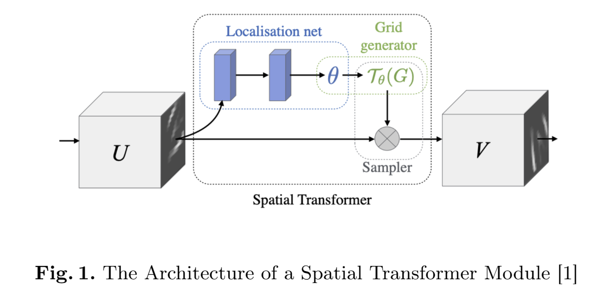
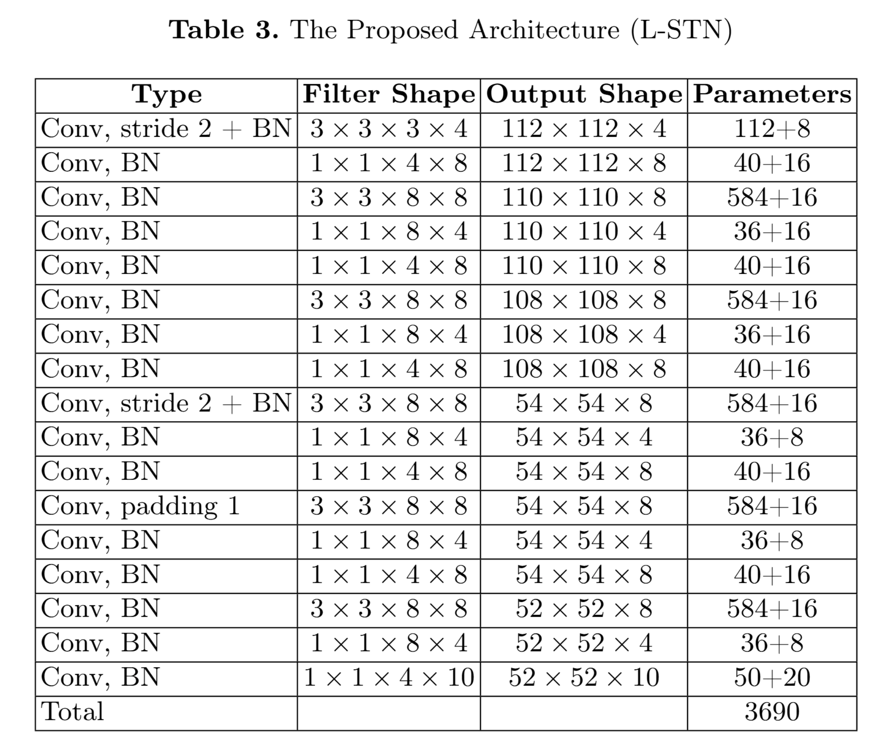
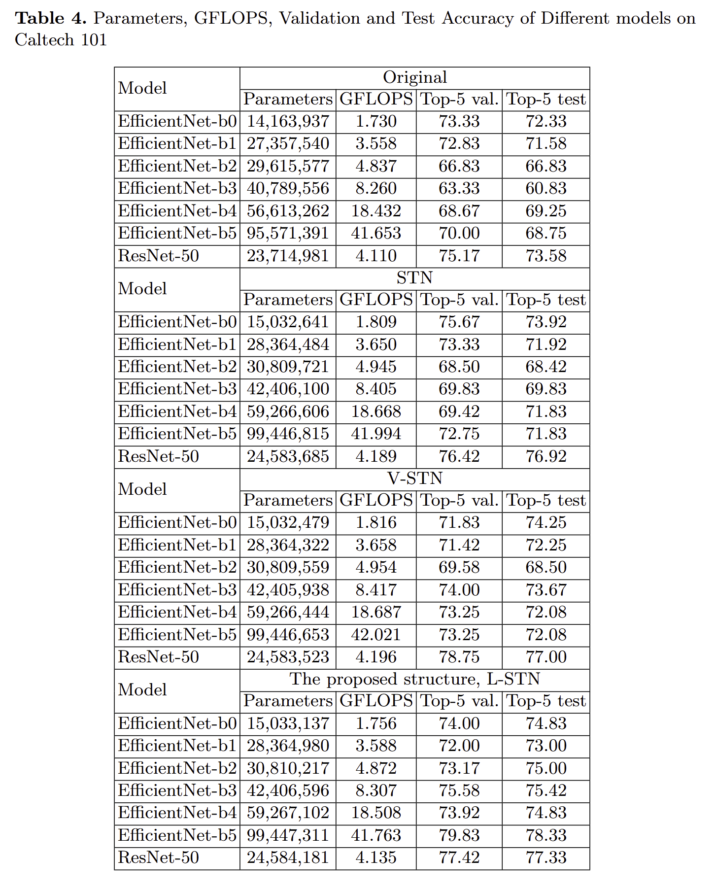
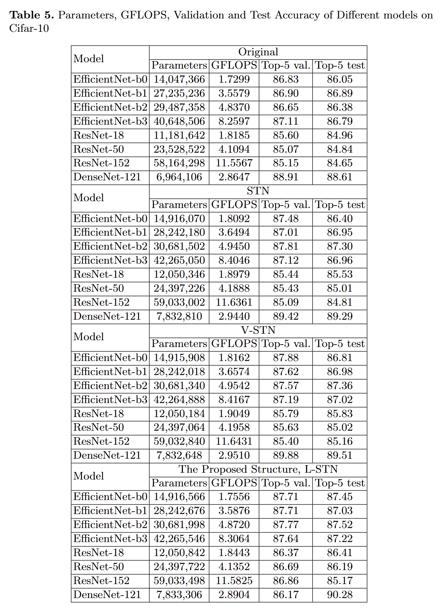
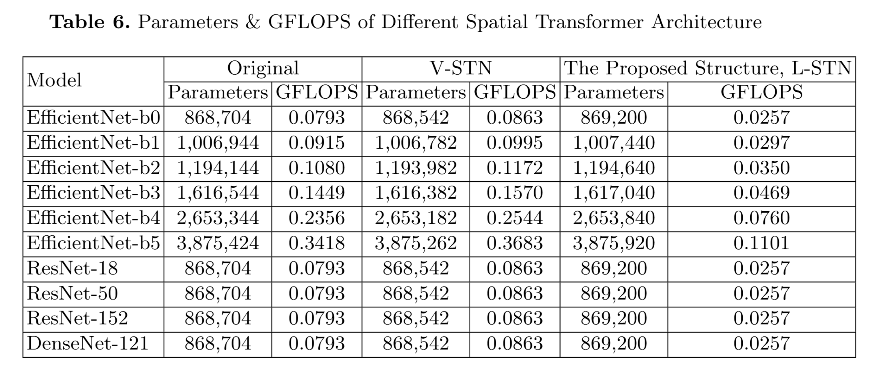

# Redesign STN Localization Net (L-STN)

    

Implementation to the L-STN network in our ISASD, 2024 paper ***"[An Improved Spatial Transformer Network based on Lightweight Localization Net (L-STN)](docs/ISASD2024.pdf)"***

## 📝 Paper Abstract

***Spatial transformer network (STN)*** is a powerful module that improves the spatial invariance
of convolutional neural networks. Amid all components, the localization net serves as the backbone
as it intakes the feature map and generates the affine transformation parameters, deciding how the
transformation to be operated. Meanwhile, the design of the ***localization net*** is closely correlated to
the outcome of transformation consequently affecting the system performance. This work simulates
through different localization net designs and examines them with several prominent models on
various datasets, and which aims to discover a ***modern localization network architecture that boosts
the performance of STN transformation with less parameters and computational overhead***.

## 🧑‍🏫 Demo

  

  

    
    

  
